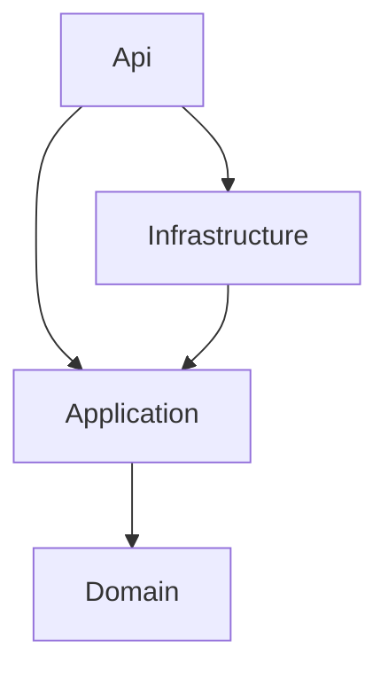

# FlowForge .NET Architecture

**.NET 10** · ASP.NET Core · EF Core · SQL Server · RS256 JWT · xUnit

```
FlowForge.sln → Domain ← Application ← Infrastructure ← Api
```



| Layer | Responsibility |
|-------|----------------|
| **Domain** | `User`, `Project`, `Task`, VOs, domain errors — zero framework refs |
| **Application** | Use-case services, FluentValidation, repo interfaces, `TaskAccess` guards |
| **Infrastructure** | `AppDbContext`, EF repos, JWT/Argon2, rate limiter |
| **Api** | Controllers, `[Authorize]`, exception filter, `Program.cs` root |

**DI:** `AddApplication()` + `AddInfrastructure(config)` in `Program.cs`. Inject `ICreateTaskUseCase` etc.; `userId` from claims only.

| Node.js | .NET |
|---------|------|
| `domain/*` | `FlowForge.Domain` |
| `application/*` | `FlowForge.Application` |
| `infrastructure/*/types.ts` | `Application/Abstractions/I*Repository.cs` |
| Prisma repos | `Infrastructure/Persistence/*Repository.cs` |
| `adapters/*` + `routes/*` | `Api/Controllers/*Controller.cs` |
| Zod | FluentValidation + records |
| `buildServer()` | `Program.cs` |
